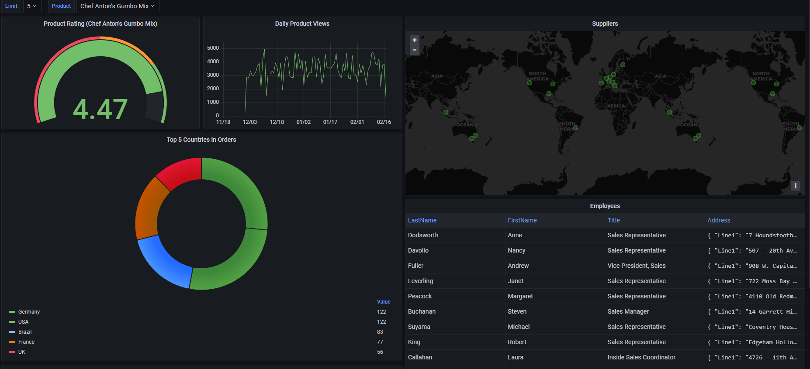
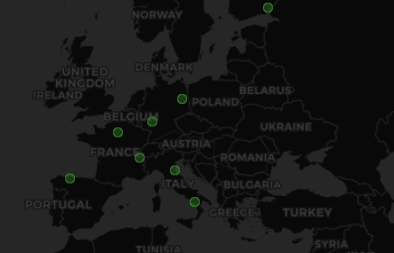

# RavenDB Grafana Data Source Plugin

[](https://github.com/ravendb/ravendb-grafana-datasource/actions?query=workflow%3A%22CI%22)
[](https://github.com/ravendb/ravendb-grafana-datasource)
[](https://github.com/ravendb/ravendb-grafana-datasource)
[](LICENSE)

This plugin allows you to connect your RavenDB to Grafana as datasource and query its data.

Note: For Monitoring RavenDB instance (not its data) please refer to: https://ravendb.net/docs/article-page/5.2/http/server/administration/monitoring



## Features

- querying for table data
- querying for time series 
- dynamic queries
- support for templating (`$__interval`, `$timeFilter` and variables)

## Documentation

Note: All queries are based on [sample data](https://ravendb.net/docs/article-page/latest/csharp/studio/database/tasks/create-sample-data)

### Query for collection/index

RQL Query:

```
from Employees select LastName, FirstName, Title, Address
```

[Syntax reference](https://ravendb.net/docs/article-page/latest/csharp/indexes/querying/what-is-rql) 

### Variables

Only first column from result is used. Use query which returns single column, ex: 

```
from "Products" select distinct Name 
```

### Referencing variables in queries

Assuming that `Product` variable is defined:

```
from index 'Product/Rating'
where Name = "${Product}"
select Rating
```

### Query from collection/index with time series data

Alias time column with name `Time`. Grafana will autodetect this as time column. Time series graph will be available.

```
from "Orders" 
select Freight, OrderedAt as Time
```

### Geospatial Queries

Project columns inside result to `Latitude` and `Longitude` columns

```
from Suppliers 
where Address.Location != null
select 
   Name, 
   Address.Location.Latitude as Latitude, 
   Address.Location.Longitude as Longitude
```



### Time series queries with dynamic group by and range filter

| Variable | Description | Example                                                     |
| -------  | ----------- |-----------------------------------------|
| $timeFilter | replaced with date from grafana date range selector | "2021-11-17T16:56:28.158Z" and "2022-02-17T09:45:12.697Z"   |
| $__interval | grafana suggested interval | 5m, 15s, etc |

```
from 'Products'
where id() == 'products/77-A'
select timeseries(
   from 'INC:Views' 
   between $timeFilter 
   group by $__interval 
   select sum()
)
```


### Support for multi-value templates

In order to properly use multi-value query variable format it using `doublequote`

```
from Employees 
where FirstName in (${paramName:doublequote})
```

It will be translated to:
```
from Employees 
where FirstName in ("Peter", "Anna", "John")
```

## Development

1. Install dependencies

   ```bash
   yarn install
   ```

2. Build plugin in development mode or run in watch mode

   ```bash
   yarn dev
   ```

   or

   ```bash
   yarn watch
   ```

3. Build plugin in production mode

   ```bash
   yarn build
   ```

## Links

- [RavenDB](https://ravendb.net)
